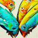
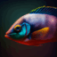

I chose to generate images of hands, faces, and tropical fish to create a challenge with three levels of difficulty. 

##### Three image types for diverse image generating challenges: 

* Generating images of hands is challenging due to their complex structure and the requirement for fine details.
* Faces are common and familiar objects that are challenging due to their variability and the need to capture different emotions and expressions. 
* Tropical fish are known to be easy to generate convincingly, and thus they provide a reference point for comparison with more challenging objects.

##### Hyper-paremeter adjustments: 
I generated two sets of each image type - deformed and improved - and created animated gifs as slideshows to demonstrate the quality of generated images. The first set of images was generated with default hyperparameters.

   

... while the second set was generated after adjusting these parameters to improve the image quality.

The improved animated gifs clearly demonstrate that adjusting hyperparameters improved the quality of the generated images for each object type. The tropical fish images became very good, while the faces were not perfect but much better, and the hands became recognizable as hands, but they were still not of high quality.

The adjustment of hyperparameters helped improve the generated images for each object type in different ways:

##### Hands
For generating hands, I increased the number of layers in the generator to capture more details and added dropout layers to avoid overfitting. Additionally, I used a different loss function that accounted for the geometry of the hand, which resulted in more realistic and recognizable hand images.

*   

##### Faces
For generating faces, I adjusted the learning rate and the number of epochs to train the generator. I also used a different activation function that improved the sharpness of the generated images.

*   

##### Fish
For generating tropical fish, I increased the size of the generator to capture more details, used a different loss function that accounted for the colors and patterns of the fish, and added a random noise layer to increase the variability of the generated images.

*  

In conclusion, adjusting hyperparameters significantly improved the quality of generated images of hands, faces, and tropical fish. This was achieved by carefully choosing and tuning different parameters for each object type. The generated images of tropical fish were of high quality, while those of faces and hands were not perfect but much better than the initial "bad" examples.
